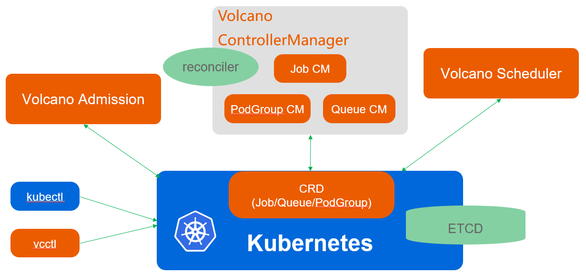
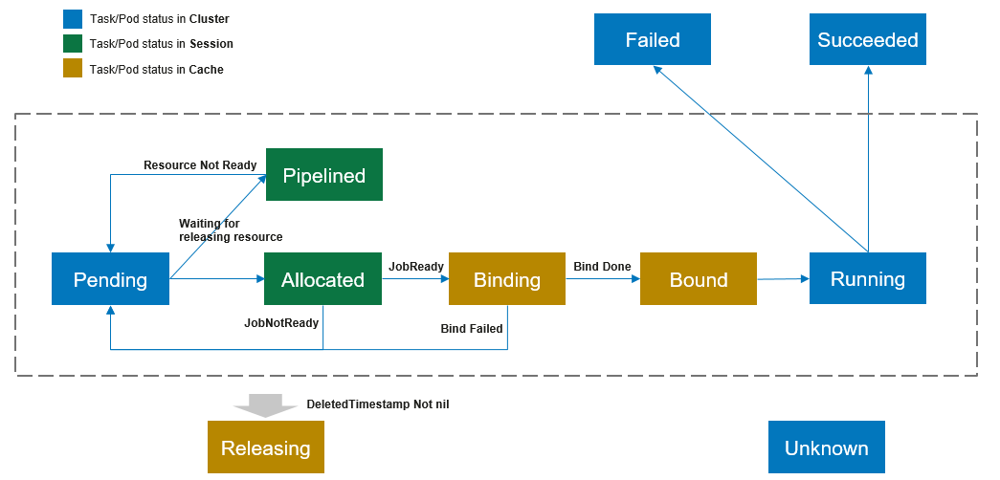

#### 系统架构

volcano由4个组件构成：
* vcctl
volcano cli客户端，可通过命令行操作volcano的资源
* volcano admission
volcano自定义CRD资源的admission，主要作用为API资源校验
* volcano controllermanager
由jobmanager、podgroupmanager和queuemanager三部分构成，负责volcano自定义CRD资源的生命周期管理
* volcano scheduler
volcano调度器，负责volcano job的调度工作
#### 工作流
volcano job的创建流程大致如下：
1. 客户端提交一个volcano job
2. 请求达到kubernetes APIServer，volcano admission进行合法性校验。若请求不合法，拒绝请求；若请求合法，持久化存储该job到etcd
3. volcano controllermanager通过List-Watch机制观察到该job的创建事件，为该job创建pod并持久化到etcd。pod初始化为pending状态
4. volcano scheduler通过List-Watch机制观察到该pod的创建事件，通过一系列计算为该pod选择一个最合适的node，并将该pod绑定到node
5. kubelet通过List-Watch机制观察到观察到该pod被调度到自己所在的node，执行创建动作并接管pod实例的管理工作
6. volcano controllermanager监控所有job的运行状态，动态保持所有的job始终处于预期状态
#### 任务状态转换

从工作流的角度看，任务可能存在以下状态：
* pending
通过admission校验后，被controllermanager创建的任务将处于pending状态。此时，任务等待被scheduler调度分配资源
* pipelined
若经过scheduler判定，任务需要的资源正在被某些处于结束状态的任务释放出来，则任务会处于pipelined状态
* allocated
若经过scheduler计算，任务需要的资源可以得到满足，则将任务置为allocated状态，等待被绑定到指定node
* binding
处于allocated状态的任务进入binding状态，表示scheduler正在将该任务绑定到指定node
* bound
binding状态的任务被scheduler完成绑定动作，将转换为bound状态，等到kubelet watch到该事件后在所在node上启动任务实例
* running
任务实例在node上运行过程中将处于running状态
* failed
任务实例在运行过程中由于某种原因未能正常达到预期，将转换为failed状态
* succeeded
任务实例正常完成计算过程后退出，将转换为succeeded状态
* releasing
任务在工作流的某个环节被删除，将转换为releasing状态
* unknown
任务在运行过程中由于某种原因状态不能被controllermanager感知到，将转换为unknown状态