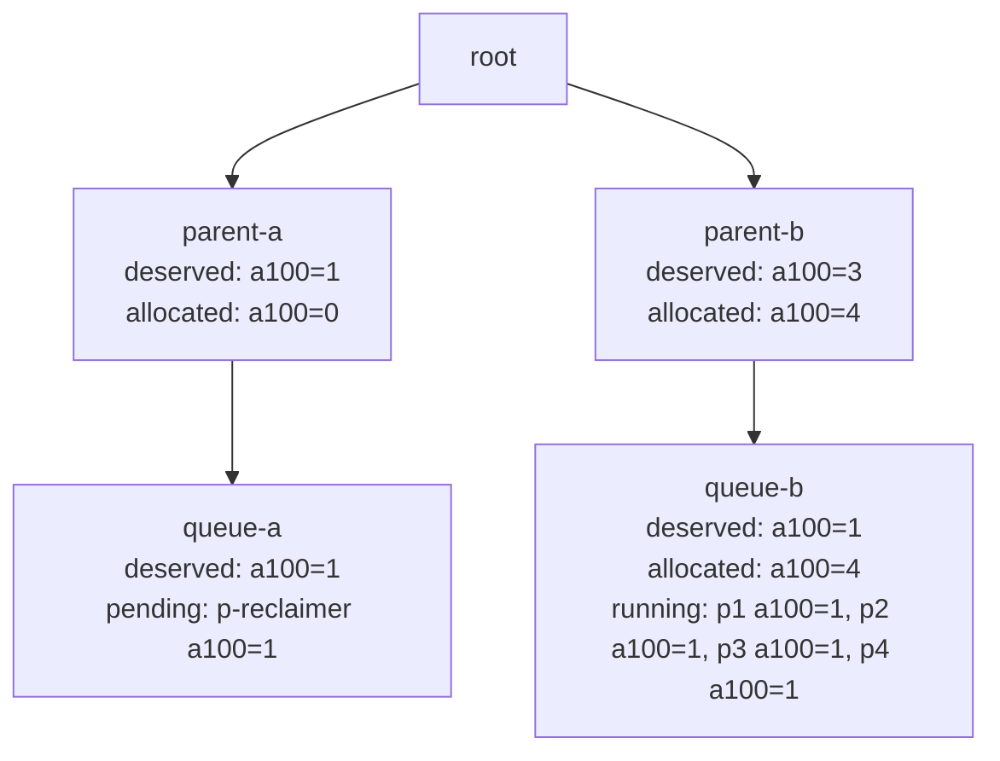
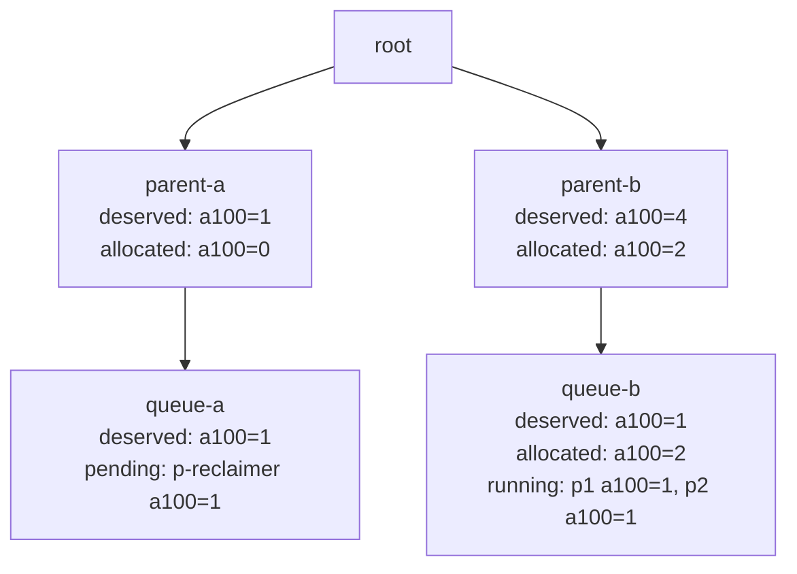
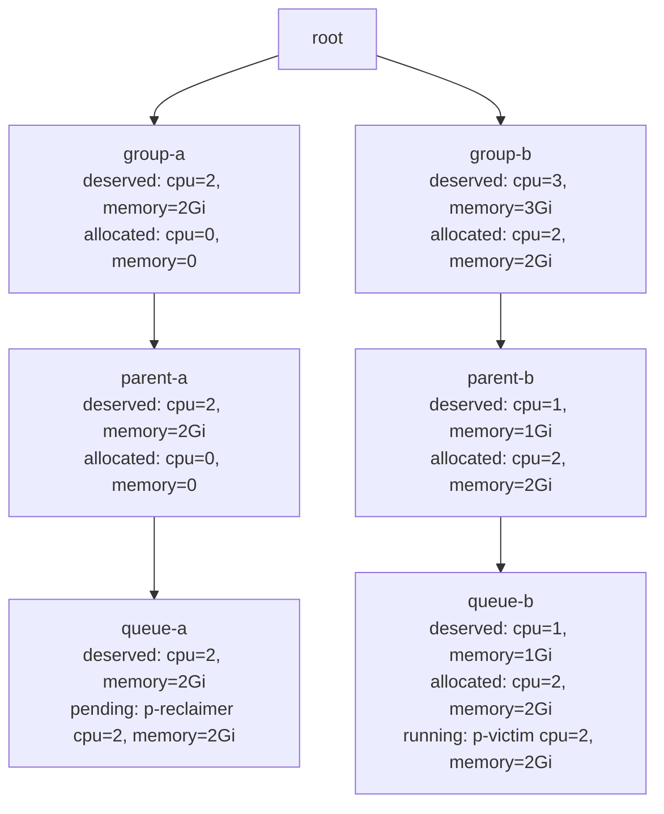
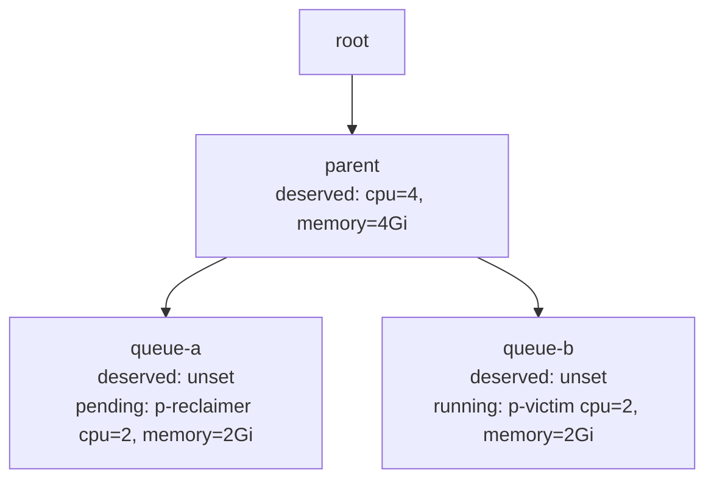
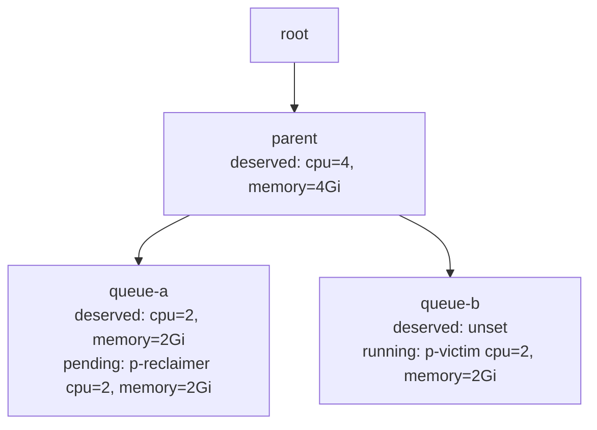

## Background
In multi-tenant scenarios, queues are a core mechanism for achieving fair scheduling, resource isolation, and task priority control. However, in the current version of Volcano, queues only support a flat structure and lack hierarchical concepts. In practical applications, different queues often belong to different departments, with hierarchical relationships between departments, leading to more refined requirements for resource allocation and preemption. To address this, Volcano latest version introduces the hierarchical queue feature, significantly enhancing queue capabilities. With this feature, users can achieve finer-grained resource quota management and preemption strategies based on hierarchical queues, building a more efficient unified scheduling platform.

For users using YARN, this feature allows seamless migration of big data workloads to Kubernetes clusters using Volcano. YARN's Capacity Scheduler already supports hierarchical queues, enabling cross-level resource allocation and preemption. Volcano latest version adopts a similar hierarchical queue design, providing more flexible resource management and scheduling strategies.

## Features Support
- Supports configuring hierarchical relationships between queues.
- Supports resource sharing and reclamation between tasks in cross-level queues.
- Supports setting resource capability limits `capability` for each resource dimension, resource entitlements `deserved` (if the allocated resources of a queue exceed its `deserved` value, the queue's resources can be reclaimed), and reserved resources `guarantee` (resources reserved for the queue that cannot be shared with other queues).

## User Guide
### Scheduler Configuration
In the new version, the hierarchical queue capability is built on the `capacity` plugin. The scheduler configuration needs to enable the `capacity` plugin, set `enableHierarchy` to `true`, and enable the `reclaim` action to support resource reclamation between queues. The scheduler configuration example is as follows:

```
kind: ConfigMap
apiVersion: v1
metadata:
  name: volcano-scheduler-configmap
  namespace: volcano-system
data:
  volcano-scheduler.conf: |
    actions: "allocate, preempt, reclaim"
    tiers:
    - plugins:
      - name: priority
      - name: gang
        enablePreemptable: false
    - plugins:
      - name: drf
        enablePreemptable: false
      - name: predicates
      - name: capacity # capacity plugin must be enabled
        enableHierarchy: true # enable hierarchical queue
      - name: nodeorder
```

### Configure Ancestor Reclaim Scope

`ancestorReclaimLevel` is configured as an argument of the `capacity` plugin. It is only meaningful when hierarchical queue mode is enabled with `enableHierarchy: true` and the scheduler has the `reclaim` action enabled.

```yaml
kind: ConfigMap
apiVersion: v1
metadata:
  name: volcano-scheduler-configmap
  namespace: volcano-system
data:
  volcano-scheduler.conf: |
    actions: "allocate, preempt, reclaim"
    tiers:
    - plugins:
      - name: priority
      - name: gang
        enablePreemptable: false
    - plugins:
      - name: drf
        enablePreemptable: false
      - name: predicates
      - name: capacity
        enableHierarchy: true
        arguments:
          ancestorReclaimLevel: 1
      - name: nodeorder
```

The value controls how many ancestor levels are checked when Volcano decides whether a running workload from another queue can be reclaimed:

- `0`: keep the default behavior. Volcano does not add ancestor-level reclaim restrictions.
- `1`: add parent-level deserved-resource checks for cross-parent reclaim.
- `2`: add grandparent-level checks when the queue topology reaches that level.
- `N`: continue the same pattern for deeper queue trees.

### Building Hierarchical Queues
A new `parent` field has been added to the Queue spec to specify the parent queue:

```
type QueueSpec struct {
    ...
	// Parent defines the parent of the queue
	// +optional
	Parent string `json:"parent,omitempty" protobuf:"bytes,8,opt,name=parent"`
    ...
}
```

Volcano Scheduler will automatically create a root queue as the root of all queues upon startup. Users can build a hierarchical queue tree based on the root queue, such as the following tree structure:


```
# The parent of child-queue-a is the root queue
apiVersion: scheduling.volcano.sh/v1beta1
kind: Queue
metadata:
  name: child-queue-a
spec:
  reclaimable: true
  parent: root 
  deserved:
    cpu: 64
    memory: 128Gi
---
# The parent of child-queue-b is the root queue
apiVersion: scheduling.volcano.sh/v1beta1
kind: Queue
metadata:
  name: child-queue-b
spec:
  reclaimable: true
  parent: root 
  deserved:
    cpu: 64
    memory: 128Gi
---
# The parent of subchild-queue-a1 is child-queue-a
apiVersion: scheduling.volcano.sh/v1beta1
kind: Queue
metadata:
  name: subchild-queue-a1
spec:
  reclaimable: true
  parent: child-queue-a
  # You can set deserved values as needed. If the allocated resources of the queue exceed the deserved value, tasks in the queue can be reclaimed.
  deserved: 
    cpu: 32
    memory: 64Gi
---
# The parent of subchild-queue-a2 is child-queue-a
apiVersion: scheduling.volcano.sh/v1beta1
kind: Queue
metadata:
  name: subchild-queue-a2
spec:
  reclaimable: true
  parent: child-queue-a 
  # You can set deserved values as needed. If the allocated resources of the queue exceed the deserved value, tasks in the queue can be reclaimed.
  deserved: 
    cpu: 32
    memory: 64Gi
---
# Submit a sample vc-job to the leaf queue subchild-queue-a1
apiVersion: batch.volcano.sh/v1alpha1
kind: Job
metadata:
  name: job-a
spec:
  queue: subchild-queue-a1
  schedulerName: volcano
  minAvailable: 1
  tasks:
    - replicas: 1
      name: test
      template:
        spec:
          containers:
            - image: alpine
              command: ["/bin/sh", "-c", "sleep 1000"]
              imagePullPolicy: IfNotPresent
              name: alpine
              resources:
                requests:
                  cpu: "1"
                  memory: 2Gi
```

When cluster resources are insufficient for pod requirement, pod's resources can be reclaimed. For pods in different queues, they will first reclaim pods in sibling queues (if the allocated resources of the sibling queue exceed the `deserved` value). If the resources in sibling queues are still insufficient to meet the pod's requirements, the hierarchical structure of the queues (i.e., ancestor queues) will be traversed upward to find sufficient resources. For example, if job-a and job-c are submitted first and the cluster resources are insufficient for job-b, job-b will first reclaim job-a. If reclaiming job-a does not meet the resource requirements, job-c will then be considered for reclaiming.

Note that in the current version, users can only submit jobs to **leaf queues**. If tasks have already been submitted to a parent queue, child queues cannot be created under that queue. This ensures effective management of resources and tasks across different levels in the queue hierarchy. Additionally, the sum of the `deserved`/`guarantee` values of child queues cannot exceed the `deserved`/`guarantee` values configured for the parent queue. Each child queue's `capability` values cannot exceed the `capability` limits of the parent queue. If a queue does not specify the `capability` value for a certain resource dimension, it will inherit the `capability` from its parent queue. If the parent queue and all ancestor queues do not specify it, the value will finally inherit from the root queue. By default, the root queue's `capability` is set to the total available resources of that dimension in the cluster.

### Understanding `ancestorReclaimLevel`

Hierarchical queues allow one part of the queue tree to use unused `deserved` resources from another part of the queue tree. When a queue later has pending work, reclaim can give those borrowed resources back from a reclaimable queue that is over its own `deserved` resources.

`ancestorReclaimLevel` controls how much of the hierarchy must be considered before a queue is treated as a valid reclaim victim. This is useful for any queue tree that encodes ownership, quota boundaries, workload classes, accelerator pools, environments, cost centers, tenants, or any other resource-sharing model.

#### Scenario 1: parent-level reclaim is allowed

In this example, `queue-b` is over its own `deserved` resources and its parent `parent-b` is also over its `deserved` resources. `queue-a` has a pending pod that cannot be scheduled without reclaim.



With `ancestorReclaimLevel: 1`, Volcano checks the leaf queue and then the parent level. Because `queue-b` and `parent-b` are both over their relevant `deserved` resources, one running pod from `queue-b` can be reclaimed and the pending pod in `queue-a` can be pipelined.

#### Scenario 2: parent-level reclaim is blocked

Here the leaf queue `queue-b` is over its own `deserved` resources, but its parent is still within its share. That means the parent branch is not borrowing more than it should at the level being protected.



With `ancestorReclaimLevel: 1`, reclaim from `queue-b` is blocked. The leaf queue is over deserved, but the protected parent-level check fails because `parent-b` is not over deserved.

#### Scenario 3: level 0 keeps the previous permissive behavior

Using the same topology as Scenario 2, `ancestorReclaimLevel: 0` does not add the parent-level gate. Volcano keeps the previous behavior and relies on the existing reclaim checks. If `queue-b` is reclaimable and over its leaf `deserved` resources, the pending pod in `queue-a` can reclaim from `queue-b` even though `parent-b` is not over deserved.

This is the compatibility setting for clusters that already rely on the existing hierarchical reclaim behavior.

#### Scenario 4: grandparent-level checks protect deeper trees

For deeper queue trees, `ancestorReclaimLevel: 2` also evaluates the grandparent level. This is useful when reclaim should respect a boundary above the direct parent.



With `ancestorReclaimLevel: 1`, reclaim can pass because the parent-level check for `parent-b` passes. With `ancestorReclaimLevel: 2`, reclaim is blocked because the grandparent-level check for `group-b` fails: `group-b` is not over its `deserved` resources. The running pod in `queue-b` is therefore not a valid reclaim victim for this pending pod.

#### Scenario 5: shared ancestors do not create an extra boundary without a reclaimer signal

For sibling queues, both queues already share the direct parent. The parent is not a boundary between different branches.



In this case, `ancestorReclaimLevel: 1` does not make the shared parent an additional reclaim gate. However, `queue-a` also has no relevant `deserved` value for the pending pod's requested resources, so the reclaimer queue has no leaf-level deserved signal for reclaim. Volcano can block reclaim to avoid evicting a sibling workload when the pending workload is not tied to a deserved share.

#### Scenario 6: sibling reclaim is allowed when the reclaimer has a deserved signal

This example uses the same shared-parent topology as Scenario 5, but `queue-a` now has a `deserved` value that matches the pending pod's requested resources.



With `ancestorReclaimLevel: 1`, the shared parent still does not add another boundary between the sibling queues. Because the reclaimer queue has a relevant `deserved` signal for the pending pod, Volcano can reclaim the running pod from `queue-b` and pipeline the pending pod in `queue-a`.

#### Choosing a value

- Use `0` when you want compatibility with the previous reclaim behavior and do not need ancestor-level restrictions.
- Use `1` when the direct parent should be the first protected boundary for cross-parent reclaim.
- Use `2` or higher when the queue hierarchy has deeper quota boundaries and reclaim should respect those higher levels too.
- Configure `deserved` on every ancestor level that should participate in reclaim decisions for the relevant resource. Without a relevant `deserved` value, an ancestor cannot provide a meaningful over-quota signal for that resource.
